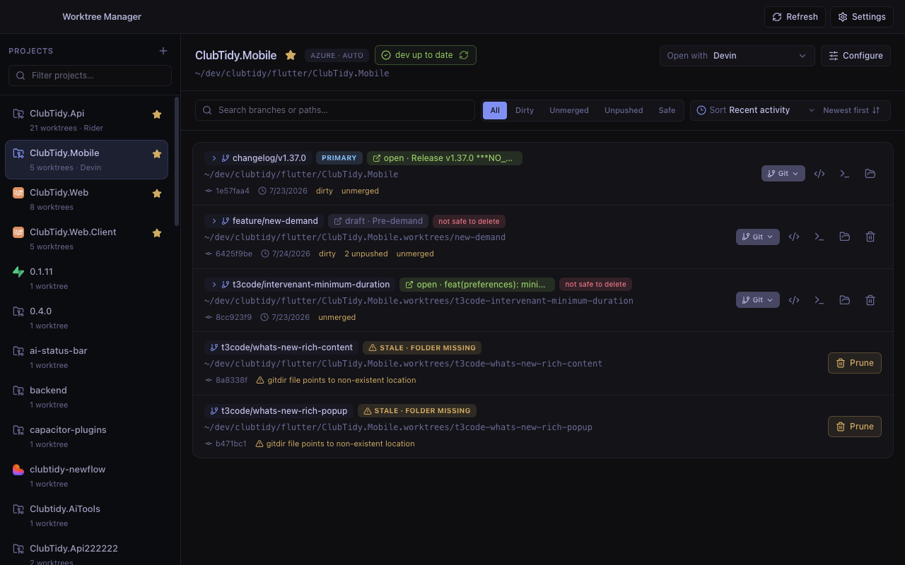
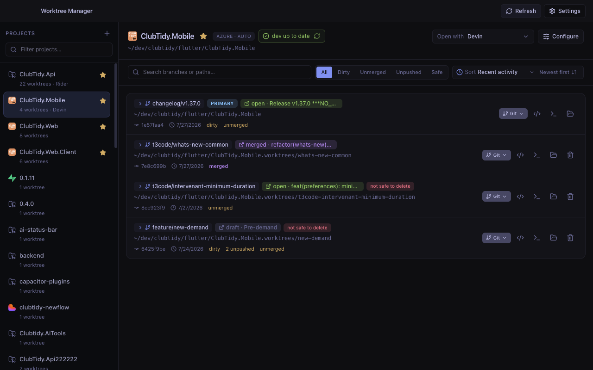

<div align="center">


# Worktree Manager

**A desktop app that makes `git worktree` usable.**

See every worktree across every repo on your machine, know at a glance which ones are
safe to delete, and reclaim the gigabytes of `node_modules` they're quietly hoarding.

[](https://github.com/Brechard/worktree-manager/actions/workflows/ci.yml)
[](LICENSE)
[](#install)

[**Install**](#install) ·
[Features](#features) ·
[Why](#why-this-exists) ·
[Build from source](#build-from-source)



</div>

---

## Why this exists

Git worktrees are the best way to work on several branches at once — no stashing, no
`git checkout` thrash, each branch a real folder your editor and dev server can hold open.
They're also the easiest thing in git to lose track of.

After a few weeks you have thirty folders across a dozen repos and no idea which ones
still matter. Was that branch merged? Did I push it? Is there a PR? Is anything
uncommitted in there? Answering that for one worktree is `cd` plus four git commands.
Answering it for thirty is an afternoon — so nobody does, the folders pile up, and each
one is carrying its own copy of `node_modules`.

Worktree Manager answers all of it on one screen, for every repo at once, and then lets
you act on the answer.

We built it at [ClubTidy](https://clubtidy.fr) because our own worktree sprawl got out of
hand — a dozen repos, several AI coding agents each working in their own worktree, and
hundreds of gigabytes of dependencies. It's MIT-licensed and standalone; nothing about it
is ClubTidy-specific.

> Inspired by [t3code](https://github.com/pingdotgg/t3code/), rebuilt around
> multi-repo scale, pull-request awareness, and disk reclaim.

## Features

### Know what's safe to delete

Every worktree is checked against the things that actually mean "don't delete this":
uncommitted changes, untracked files, unpushed commits, an unmerged branch, an open pull
request. Anything that passes all five is labelled **safe** — everything else tells you
exactly which check it failed.

The safety check fails closed. If git can't read the working tree, or the base-branch
fetch failed so "merged" can't be trusted, the worktree is not marked safe.

### See it across every repo

Point it at the directories you keep code in and it discovers every git repository and
every linked worktree underneath. Filter to dirty / unmerged / unpushed / safe, sort by
recent activity, search branches and paths, star the projects you live in.

### Pull requests inline

Connect GitHub or Azure DevOps and each branch shows its PR — title, state, draft,
merged — right on the row. It picks up an existing `gh auth` or `az` login (and the usual
`GH_TOKEN` / `AZURE_DEVOPS_PAT` environment variables), so often there's no token to paste
at all. Tokens you do provide are encrypted at rest via Electron's `safeStorage`.

### Reclaim disk

The reason ten branches cost ten copies of your dependency tree. Worktree Manager
measures the regenerable directories (`node_modules`, build output, caches) across your
worktrees and lets you delete them from one place. It's a deliberate allow-list of
directories a tool can rebuild — never "everything git ignores", which would take your
`.env` files with it.

### Real git actions, not just a list

Merge, merge --no-ff, squash merge, rebase onto base, push, checkout, prune stale
worktrees. Plus per-project custom action buttons: define a command once (`docker compose
up`, `bun install`, your test suite) and run it against any worktree in a terminal or in
the background.

### Opens where you work

Detects your installed editors and opens a worktree in the one you pick — per project, so
the Rider repo opens in Rider and the TypeScript one opens in Cursor. Also opens a
terminal or a file manager at the worktree path.

<div align="center">

</div>

## Install

No prebuilt binaries are published. The project has no code-signing certificate yet, so
downloaded builds get flagged as **damaged** by Gatekeeper on macOS (and warned about by
SmartScreen on Windows) — more trouble than they're worth. Building on your own machine
produces the same app with no quarantine flag and no warnings.

### One command

Requires [Bun](https://bun.sh) 1.3+, Node 22+ and git (Git Bash on Windows):

```bash
git clone https://github.com/Brechard/worktree-manager.git
cd worktree-manager && ./scripts/install-local.sh
```

The script detects your OS and CPU architecture, installs dependencies, builds the
matching installer, and on macOS moves the app into `/Applications` and launches it.
Pass `--no-install` if you only want the artifact.

Artifacts land in `apps/desktop/release/`:

| Platform | Artifact                                       |
| -------- | ---------------------------------------------- |
| macOS    | `Worktree Manager-<version>-<arch>.dmg`        |
| Windows  | `Worktree Manager Setup <version>.exe`         |
| Linux    | `Worktree.Manager-<version>-<arch>.AppImage`   |

### Build from source

Requires [Bun](https://bun.sh) 1.3+ and Node 22+.

```bash
git clone https://github.com/Brechard/worktree-manager.git
```

```bash
cd worktree-manager && bun install && bun dev
```

To produce an installer for your own platform manually:

```bash
bun run dist
```

or, for a specific target:

```bash
cd apps/desktop && npx electron-builder --mac # or --win, --linux
```

## How it works

Nothing leaves your machine. Worktree Manager shells out to your local `git` and reads
the filesystem; the only network calls it ever makes are to GitHub or Azure DevOps to
look up a pull request, and only if you connect them. There is no account, no telemetry,
and no server.

Settings live in the Electron user-data directory as plain JSON — provider tokens are the
one exception and go through Electron's `safeStorage` (Keychain on macOS, DPAPI on
Windows, libsecret on Linux).

## Tech stack

Electron · React 19 · TypeScript · Tailwind CSS 4 · Zustand · TanStack Query · Zod ·
Bun workspaces · Turbo

Git logic lives in `packages/shared` and runs only in the main process; the renderer
reaches it over typed IPC. `packages/contracts` holds the Zod schemas both sides share.
See [CLAUDE.md](CLAUDE.md) for the architecture notes and development gotchas.

## Contributing

Issues and pull requests are welcome — see [CONTRIBUTING.md](CONTRIBUTING.md).
If you use it and it saves you a folder, a ⭐ helps other people find it.

## License

[MIT](LICENSE) © [ClubTidy](https://clubtidy.fr)
